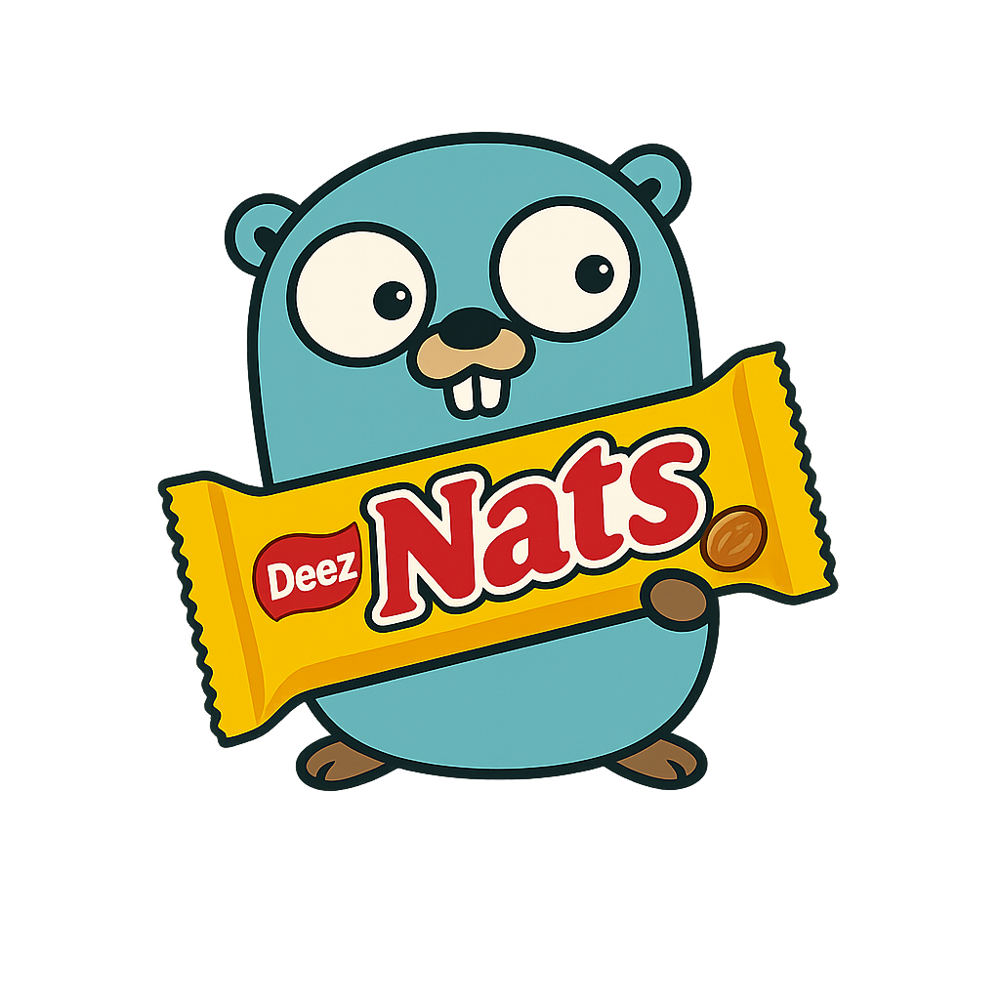

# deez-nats



_[Русская версия документации](README.ru.md)_

Utilities for building RPC and event-driven applications on top of [NATS](https://nats.io) in Go. The library ships with a unified router for RPC methods and events, middleware support, typed helpers, and several marshallers (JSON and Protobuf) to speed up onboarding and simplify long-term maintenance.

## Features

- **Unified router** with grouping (`Group`) and middleware inheritance for both RPC and events.
- **RPC handling** with automatic ack/nak management and a convenient `RPCContext` for reading requests, sending responses, and working with headers.
- **Event handlers with JetStream**: queue / pull consumers, auto-ack, durable configuration, and subject transforms.
- **Typed helpers** for RPC (`natsrpc.AddTyped…`) and events (`natsevents.AddTypedCore…` / `natsevents.AddTypedJetStream…`) with generics support and pluggable marshallers.
- **Flexible marshallers**: built-in JSON and Protobuf implementations, plus the option to provide your own.
- **Examples** for a quick start: from a simple scenario to a fully typed pipeline.

## Installation

```sh
go get github.com/leinodev/deez-nats
```

Requires Go 1.21+ (the module is built with `go 1.25`).

## Quick Start

```go
nc, _ := nats.Connect(nats.DefaultURL)
defer nc.Close()

eventsSvc := natsevents.New(nc)
rpcSvc := natsrpc.New(nc)

rpcSvc.AddRPCHandler("user.ping", func(ctx natsrpc.RPCContext) error {
    var req PingRequest
    if err := ctx.Request(&req); err != nil {
        return err
    }
    return ctx.Ok(PingResponse{Message: "pong"})
})

eventsSvc.AddEventHandler("user.created", func(ctx natsevents.EventContext[*nats.Msg, nats.AckOpt]) error {
    var payload UserCreatedEvent
    if err := ctx.Event(&payload); err != nil {
        return err
    }
    fmt.Printf("created: %#v\n", payload)
    return nil
})

ctx, cancel := context.WithCancel(context.Background())
defer cancel()

go rpcSvc.StartWithContext(ctx)
go eventsSvc.StartWithContext(ctx)

_ = eventsSvc.Emit(ctx, "user.created", UserCreatedEvent{ID: "42"})
var resp PingResponse
_ = rpcSvc.CallRPC(ctx, "user.ping", PingRequest{ID: "42"}, &resp)
```

## RPC

- `natsrpc.New` creates a service with the default JSON marshaller.
- `AddRPCHandler` builds a hierarchical route tree; methods can be grouped (`Service.Group("user")`).
- `RPCContext` offers:
  - `Request(&reqStruct)` — request deserialization;
  - `Ok(response)` — sending a successful response;
  - `Headers()` and `RequestHeaders()` — working with headers.
- `CallRPC` wraps a request with NATS timeout handling and response deserialization.
- For generics, use `natsrpc.AddTypedJsonRPCHandler`, `AddTypedProtoRPCHandler`, or `AddTypedRPCHandler` with your custom marshaller.
- Use `natsrpc.WithHandlerMiddlewares(...)` to add middlewares to specific handlers.

### RPC Options

Use functional options to configure RPC service:

```go
rpcSvc := natsrpc.New(nc,
    natsrpc.WithBaseRoute("myservice"),
    natsrpc.WithDefaultHandlerMarshaller(customMarshaller),
    natsrpc.WithDefaultCallOptions(
        natsrpc.WithCallHeader("X-Service", "my-service"),
    ),
)

// Add handler with middlewares
rpcSvc.AddRPCHandler("user.get", handler,
    natsrpc.WithHandlerMarshaller(customMarshaller),
    natsrpc.WithHandlerMiddlewares(
        authMiddleware,
        loggingMiddleware,
    ),
)

// Call RPC with options
rpcSvc.CallRPC(ctx, "user.ping", request, &response,
    natsrpc.WithCallHeader("X-Request-ID", "123"),
    natsrpc.WithCallMarshaller(customMarshaller),
)
```

## Events

The library provides two event implementations:

- **`natsevents.New`** — standard NATS subscriptions with queue groups
- **`natsevents.NewJetStream`** — JetStream-based events with consumer configuration

### Core Events

```go
nc, _ := nats.Connect(nats.DefaultURL)
defer nc.Close()

coreEvents := natsevents.New(nc,
    natsevents.WithCoreQueueGroup("my-queue-group"),
    natsevents.WithCoreDefaultEmitMarshaller(customMarshaller),
    natsevents.WithCoreDefaultEmitHeader("X-Service", "my-service"),
    natsevents.WithCoreDefaultEventHandlerMarshaller(customMarshaller),
)

coreEvents.AddEventHandler("user.created", func(ctx natsevents.EventContext[*nats.Msg, nats.AckOpt]) error {
    var payload UserCreatedEvent
    if err := ctx.Event(&payload); err != nil {
        return err
    }
    fmt.Printf("created: %#v\n", payload)
    return nil
}, natsevents.WithCoreHandlerQueue("handler-queue"))

ctx, cancel := context.WithCancel(context.Background())
defer cancel()

go coreEvents.StartWithContext(ctx)

_ = coreEvents.Emit(ctx, "user.created", UserCreatedEvent{ID: "42"},
    natsevents.WithCoreEmitHeader("X-Request-ID", "123"),
)
```

### JetStream Events

```go
js, _ := jetstream.New(nc)

jetStreamEvents := natsevents.NewJetStream(js,
    natsevents.WithJetStreamStream("EVENTS"),
    natsevents.WithJetStreamDeliverGroup("events-group"),
    natsevents.WithJetStreamDefaultEmitMarshaller(customMarshaller),
    natsevents.WithJetStreamDefaultEmitHeader("X-Service", "my-service"),
    natsevents.WithJetStreamDefaultEventHandlerMarshaller(customMarshaller),
)

jetStreamEvents.AddEventHandler("entity.created", handler,
    natsevents.WithJetStreamHandlerMarshaller(customMarshaller),
)

ctx, cancel := context.WithCancel(context.Background())
defer cancel()

go jetStreamEvents.StartWithContext(ctx)

_ = jetStreamEvents.Emit(ctx, "entity.created", payload,
    natsevents.WithJetStreamEmitMarshaller(customMarshaller),
    natsevents.WithJetStreamEmitHeader("X-Request-ID", "123"),
)
```

### Event Options

**Core Events Options:**
- `WithCoreQueueGroup(queueGroup)` — default queue group for all handlers
- `WithCoreDefaultEmitMarshaller(m)` — default marshaller for all emits
- `WithCoreDefaultEmitHeader(key, value)` — default header for all emits
- `WithCoreDefaultEmitHeaders(headers)` — default headers for all emits
- `WithCoreDefaultEventHandlerMarshaller(m)` — default marshaller for all handlers
- `WithCoreHandlerMarshaller(m)` — marshaller for specific handler
- `WithCoreHandlerQueue(queue)` — queue for specific handler (overrides default)
- `WithCoreEmitMarshaller(m)` — marshaller for specific emit (overrides default)
- `WithCoreEmitHeader(key, value)` — header for specific emit (merged with defaults)
- `WithCoreEmitHeaders(headers)` — headers for specific emit (merged with defaults)

**JetStream Events Options:**
- `WithJetStreamStream(stream)` — JetStream stream name
- `WithJetStreamDeliverGroup(group)` — deliver group for consumers
- `WithJetStreamDefaultEmitMarshaller(m)` — default marshaller for all emits
- `WithJetStreamDefaultEmitHeader(key, value)` — default header for all emits
- `WithJetStreamDefaultEmitHeaders(headers)` — default headers for all emits
- `WithJetStreamDefaultEventHandlerMarshaller(m)` — default marshaller for all handlers
- `WithJetStreamHandlerMarshaller(m)` — marshaller for specific handler
- `WithJetStreamEmitMarshaller(m)` — marshaller for specific emit (overrides default)
- `WithJetStreamEmitHeader(key, value)` — header for specific emit (merged with defaults)

### EventContext

`EventContext` provides:
- `Event(&payload)` — message deserialization
- `Ack/Nak/Term/InProgress` — JetStream delivery control (for JetStream events)
- `Headers()` — access to message headers
- `Message()` — access to the original message

**Note:** `DefaultHeaders` in `JetStreamEventHandlerOptions` are currently defined but not actively used in handler processing. They are reserved for future functionality.

### Typed Event Handlers

For type-safe event handling with generics, use typed helpers:

**Core Events:**
```go
natsevents.AddTypedCoreJsonEventHandler(coreEvents, "user.created", func(ctx natsevents.EventContext[*nats.Msg, nats.AckOpt], payload UserCreatedEvent) error {
    fmt.Printf("user created: %#v\n", payload)
    return nil
})

natsevents.AddTypedCoreProtoEventHandler(coreEvents, "user.updated", func(ctx natsevents.EventContext[*nats.Msg, nats.AckOpt], payload UserUpdatedEvent) error {
    fmt.Printf("user updated: %#v\n", payload)
    return nil
}, natsevents.WithCoreHandlerQueue("user-queue"))
```

**JetStream Events:**
```go
natsevents.AddTypedJetStreamJsonEventHandler(jetStreamEvents, "entity.created", func(ctx natsevents.EventContext[jetstream.Msg, any], payload EntityCreatedEvent) error {
    fmt.Printf("entity created: %#v\n", payload)
    return nil
})

natsevents.AddTypedJetStreamEventHandlerWithMarshaller(jetStreamEvents, "entity.updated", func(ctx natsevents.EventContext[jetstream.Msg, any], payload EntityUpdatedEvent) error {
    fmt.Printf("entity updated: %#v\n", payload)
    return nil
}, customMarshaller, natsevents.WithJetStreamHandlerMarshaller(customMarshaller))
```

Available typed helpers:
- `AddTypedCoreEventHandler` / `AddTypedJetStreamEventHandler` — base functions
- `AddTypedCoreEventHandlerWithMarshaller` / `AddTypedJetStreamEventHandlerWithMarshaller` — with custom marshaller
- `AddTypedCoreJsonEventHandler` / `AddTypedJetStreamJsonEventHandler` — with JSON marshaller
- `AddTypedCoreProtoEventHandler` / `AddTypedJetStreamProtoEventHandler` — with Protobuf marshaller

## Graceful Shutdown

The library supports graceful shutdown for both RPC and event services. This allows you to properly finish processing active requests and events before stopping the service.

### Usage

Both services (`natsrpc.NatsRPC` and `natsevents.CoreNatsEvents` / `natsevents.JetStreamNatsEvents`) implement the `Shutdown(ctx context.Context) error` method, which:

1. **Stops accepting new messages** — subscriptions are drained, new requests and events are no longer accepted.
2. **Waits for active handlers to finish** — all running handlers are given a chance to complete their work.
3. **Unsubscribes from all subscriptions** — after all handlers finish, unsubscription from NATS subjects occurs.

### Example

```go
package main

import (
    "context"
    "log"
    "os"
    "os/signal"
    "syscall"
    "time"

    "github.com/nats-io/nats.go"
    "github.com/leinodev/deez-nats/natsevents"
    "github.com/leinodev/deez-nats/natsrpc"
)

func main() {
    nc, _ := nats.Connect(nats.DefaultURL)
    defer nc.Close()

    eventService := natsevents.New(nc)
    rpcService := natsrpc.New(nc)

    // ... configure handlers ...

    ctx, cancel := context.WithCancel(context.Background())
    defer cancel()

    go eventService.StartWithContext(ctx)
    go rpcService.StartWithContext(ctx)

    // Wait for shutdown signal (SIGINT or SIGTERM)
    sigChan := make(chan os.Signal, 1)
    signal.Notify(sigChan, os.Interrupt, syscall.SIGTERM)

    <-sigChan
    log.Println("Received shutdown signal, starting graceful shutdown...")

    // Cancel context to stop processing new messages
    cancel()

    // Perform graceful shutdown with timeout
    shutdownCtx, shutdownCancel := context.WithTimeout(context.Background(), 10*time.Second)
    defer shutdownCancel()

    if err := eventService.Shutdown(shutdownCtx); err != nil {
        log.Printf("events service shutdown error: %v", err)
    } else {
        log.Println("events service shutdown completed")
    }

    if err := rpcService.Shutdown(shutdownCtx); err != nil {
        log.Printf("rpc service shutdown error: %v", err)
    } else {
        log.Println("rpc service shutdown completed")
    }

    log.Println("Graceful shutdown completed")
}
```

### Important Notes

- **Timeout**: Always use a context with timeout for `Shutdown()` to avoid infinite waiting.
- **Order**: First cancel the context (`cancel()`), then call `Shutdown()` — this ensures that new messages won't be accepted.
- **Error handling**: If `Shutdown()` returns an error (e.g., `context.DeadlineExceeded`), it means not all handlers finished within the allotted time. In this case, you can decide to force termination.

Full graceful shutdown implementation can be found in `examples/typed/main.go`.

## Marshallers

The library ships with two ready-to-use marshallers:

- `marshaller.DefaultJsonMarshaller`
- `marshaller.DefaultProtoMarshaller`

Both implement the `marshaller.PayloadMarshaller` interface. You can replace them with a custom implementation via `HandlerOptions`, `CallOptions`, `EventHandlerOptions`, or `EventPublishOptions`.

## Examples

- `examples/typed` — typed RPC and event handlers with generics for JSON payloads:

```12:38:examples/typed/router.go
// ... existing code ...
```

- `examples/nrpc` — RPC example with Protobuf marshaller:

```25:45:examples/nrpc/main.go
// ... existing code ...
```

Run the examples directly (`go run ./examples/typed`, `go run ./examples/nrpc`) after spinning up a local NATS (`docker-compose up nats` or `nats-server`).

## Local Development

1. Install dependencies: `go mod tidy`.
2. Start NATS (see `docker-compose.yml`).
3. Run integration tests: `go test ./...`.

Contributions and feature ideas are welcome!
